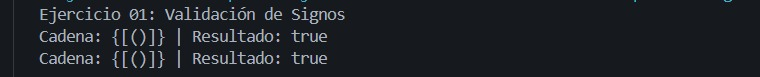
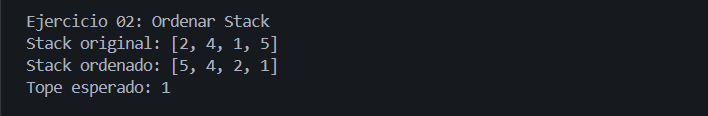
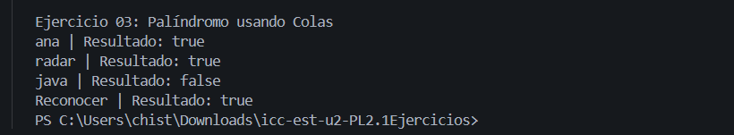
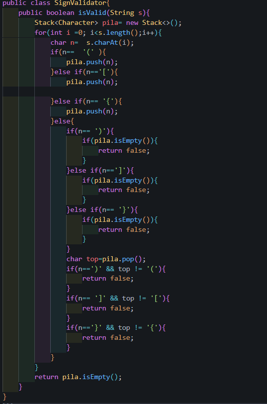
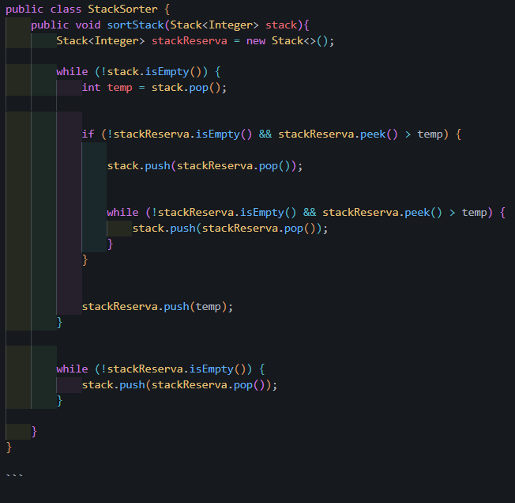
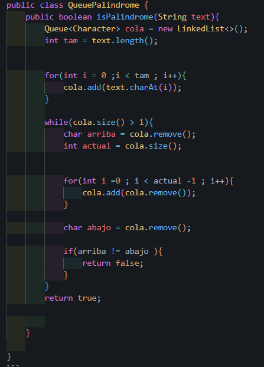

# Práctica: Estructuras Dinámicas Lineales

## Datos del Estudiante
- **Nombre:** Christian Villa
- **Curso:** Grupo 3
- **Fecha:** 10/06/2026

---
**Descripción General de el Proyecto:**
En este proyecto vamos a realizar tres ejercicios que implementen todo lo que hemos aprendido en clase para los diferentes ejercicios ocuparemos diferentes modos de ordenarlos compararlos y validarlos.


## Ejercicio 01 : Validaciòn de Signos


**Descripción:**

En este ejercicio fui comparando los signos que entraban en tipo texto y los sacabo con sus respectivas herramientas como el tipo char y eso lo q nos va a ayudar 


## Ejercicio 02 :  Ordenar un stack 


**Descripción:**

En este codigo se utiliza un pila exterma para sacar los elementos de la pila original y irlos comparando uno a uno , de cierto modo que algunos valores menores queden siempre en el tope.

## Ejercicio 03 : Palindormo usando colas

**Descripción:**
En este codigo se van a insertar datos tipo String al extraerlos la pila va a devolver ciertos caracteres en diferentes ordenes inverso mientras que las colas las daran en orden original.Se van a comparar los elementos de ambas estructuras uno a uno si todos van a coincidir , si es asi la palabra es palindroma.

### Captura de salidas en consola
## Ejercicio 1 :



## Ejercicio 2 :



## Ejercicio 3 :




### Captura del código de implementación de los ejercicios 
## Ejercicio 1 :
```java
public class SignValidator{
    public boolean isValid(String s){
        Stack<Character> pila= new Stack<>();
        for(int i =0; i<s.length();i++){
            char n=  s.charAt(i);
            if(n==  '(' ){
                pila.push(n);
            }else if(n=='['){
                pila.push(n);

            }else if(n== '{'){
                pila.push(n);
            }else{
                if(n== ')'){
                    if(pila.isEmpty()){
                        return false;
                    }
                }else if(n==']'){
                    if(pila.isEmpty()){
                        return false;
                    }
                }else if(n== '}'){
                    if(pila.isEmpty()){
                        return false;
                    }
                }
                char top=pila.pop();
                if(n==')' && top != '('){
                    return false;
                }
                if(n== ']' && top != '['){
                    return false;
                }
                if(n=='}' && top != '{'){
                    return false;
                }
            }
        }
        return pila.isEmpty();
    }
}
```

## Ejercicio 2 :
```java
public class StackSorter {
    public void sortStack(Stack<Integer> stack){
        Stack<Integer> stackReserva = new Stack<>();

        while (!stack.isEmpty()) {
            int temp = stack.pop();

            
            if (!stackReserva.isEmpty() && stackReserva.peek() > temp) {
                
                stack.push(stackReserva.pop());
                
                
                while (!stackReserva.isEmpty() && stackReserva.peek() > temp) {
                    stack.push(stackReserva.pop());
                }
            }
            
            
            stackReserva.push(temp);
        }

        
        while (!stackReserva.isEmpty()) {
            stack.push(stackReserva.pop());
        }

    }
}

```


## Ejercicio 3 :
```java
public class QueuePalindrome {
    public boolean isPalindrome(String text){
        Queue<Character> cola = new LinkedList<>();
        int tam = text.length();


        for(int i = 0 ;i < tam ; i++){
            cola.add(text.charAt(i));
        }
        
        while(cola.size() > 1){
            char arriba = cola.remove();
            int actual = cola.size();


            for(int i =0 ; i < actual -1 ; i++){
                cola.add(cola.remove());
            }

            char abajo = cola.remove();

            if(arriba != abajo ){
                return false;
            }
        }
        return true;

        
    }
    
}
```


### Tabla de evidencias requeridas


| Ejercicio | Evidencias de código | Evidencias de consola | Observación |
| :--- | :---: | :---: | :--- |
| Ejercicio 01: Validación de signos |  |  |  Aca pudimor hacer este ejercicio con if y else if lo cual nos ayudo mucho en la comparacion de estos datos tipo string y poder ver si nos podia retornar tru o false.|
| Ejercicio 02: Ordenar un stack |  |  | Al hacer por stack pudimos ver del como la logica funciona con este tipo de arreglos sin tener q usar los metodos de ordenamiento .|
| Ejercicio 03: Palíndromo usando colas |  |  | Al hacer este codigo podemos evidenciar     ue de las dos formas practicadas la de filas y la de columnas de ambas formas se puede hacer este ejercicio todo deende del contexto y el como lo aplicamos.|


## Conclusiones

El estudiante debe redactar al menos tres conclusiones propias relacionadas con el uso de pilas y colas.

- Conclusión 1: Como conclusion pudimos ver que en los ejercicios que hicimos podemos aplicar los metodos de pilas columans y etc como lo son el peek el pop entre otros los cuales nos van a aayudar ha hacer comparaciones y ordenar datos.
- Conclusión 2: Tambien pudimos evidenciar que al usar estos metodos la mayoria de los codigos van a  poder realizarse mediante bucles como lo son el while y el for los cuales los hacen mucho mas cortos y faciles de hacer y entender.
- Conclusión 3: Como ultima conclusion puedo decir que el entender el uso de pilas y colas nos pueden dar una vivibilidad distintas a problemas que nos enfrentemos de ahora en adelante.


